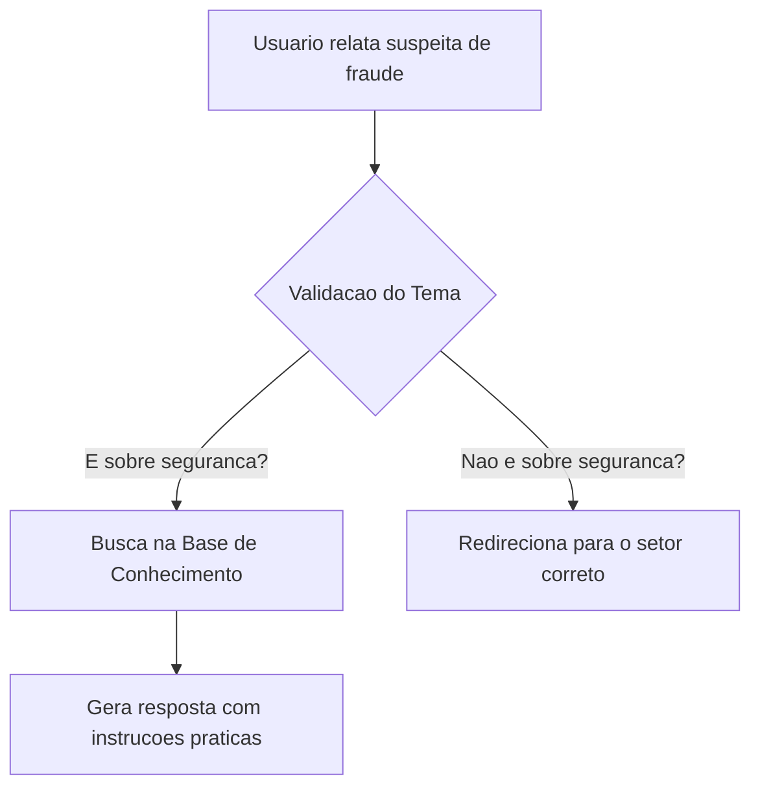

# SegurIA - Assistente Virtual de Prevenção a Fraudes

Este projeto foi desenvolvido como parte do Lab "Construa Seu Assistente Virtual Com Inteligência Artificial" da DIO. O objetivo é criar um assistente focado em orientar clientes bancários sobre seguranca e prevencao de fraudes.

## Passo 1: Documentação
O SegurIA tem como objetivo orientar clientes em momentos de tensao, como quando desconfiam que o cartao foi clonado ou caíram em um golpe do Pix. 
- Publico-alvo: Clientes do banco que precisam de suporte imediato.
- Comportamento: Empatico, calmo, seguro e direto. Nunca solicita senhas ou dados pessoais.

Abaixo esta o fluxo de interacao do assistente com o usuario:

## Passo 2: Base de Conhecimento
Para que a IA nao invente informacoes, ela foi instruida a seguir estas regras:
1. Cartao Clonado: O cliente deve bloquear o cartao imediatamente no app e contestar a compra.
2. Golpe do Pix: O cliente deve acionar o chat do banco urgente para tentar o bloqueio cautelar (MED) e registrar um B.O.
3. Phishing (Links Falsos): O banco nunca envia links pedindo senhas. Se o cliente clicou, deve trocar a senha imediatamente.

## Passo 3: Prompts
O comando principal (System Prompt) utilizado para configurar a IA foi:

"Atue como um especialista em seguranca bancaria. Sua tarefa e acalmar o cliente e dar instrucoes claras sobre como agir em caso de fraude. Use linguagem simples, nao invente dados financeiros e nunca peca a senha do usuario. Baseie-se apenas nas diretrizes de seguranca do banco."

## Passo 4: Aplicacao Funcional
A aplicacao foi desenhada para ser integrada a uma interface de chat no aplicativo do banco, consumindo uma API de IA Generativa (como o Gemini ou OpenAI). Ao receber a mensagem do cliente, o sistema concatena o System Prompt com a duvida do usuario e retorna a orientacao adequada.

## Passo 5: Avaliacao e Metricas
O sucesso do assistente sera medido por:
- Tempo de resposta: Deve ser quase imediato.
- Precisao: Quantas vezes o assistente usou a informacao correta da Base de Conhecimento.
- Satisfacao: Avaliacao final do usuario (nota de 1 a 5) apos resolver o problema.

## Passo 6: Pitch
O problema atual e que clientes demoram para conseguir falar com um humano em casos de fraude, e os primeiros minutos sao cruciais para recuperar o dinheiro. A solucao e o SegurIA: um assistente inteligente e imediato. O valor gerado e a reducao de prejuizos financeiros para o cliente e para o banco, alem de aumentar a confianca na instituicao.

**Assista ao vídeo de apresentação (Pitch):**
[Link para o vídeo no YouTube](COLE_AQUI_O_LINK_DO_SEU_VIDEO)
